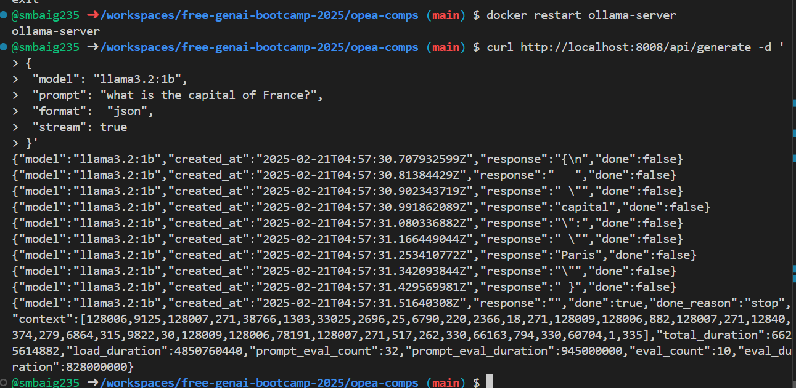
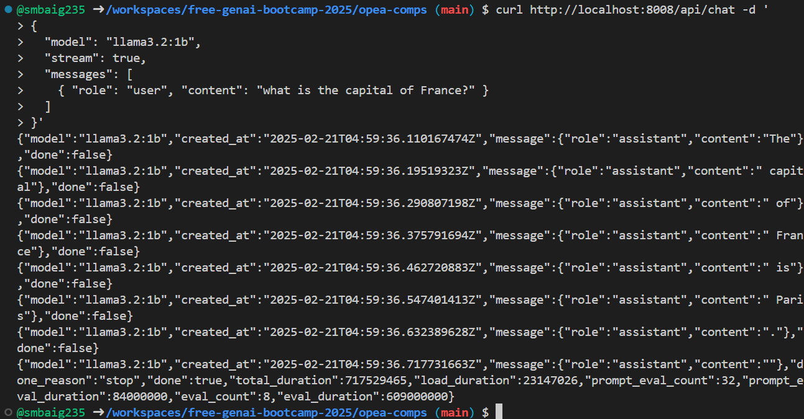
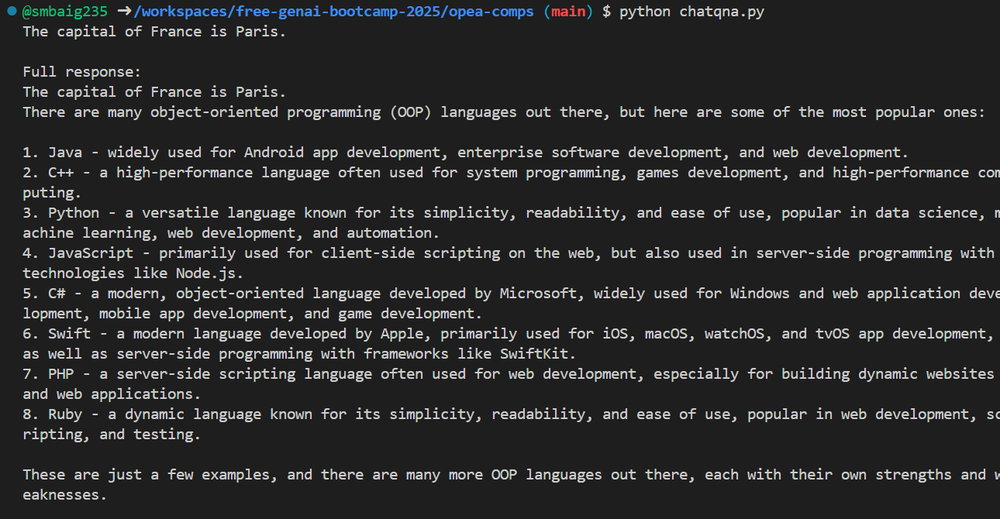

   
# Open Platform for Enterprise AI (OPEA)
   
  ## GenAIComps 

GenAIComps (Generative AI Components) is an open-source project under the Open Platform for Enterprise AI (OPEA) initiative.
GenAIComps is a modular, open-source toolkit for developing enterprise-level Generative AI applications, designed to simplify AI workflows and enable easy scaling. 
It supports multiple cloud platforms and integrates with services like ChatQnA and DocSum for practical use cases.

## GenAIExamples

GenAIExamples provides the deployable solutions shows how to implement GenAIComps effectively. 

### Examples include:

- ChatQnA: A solution for real-time conversational AI.
- DocSum: A document summarization tool for condensing large texts into key points.

## OPEA Comps Project

### Step 1: 

first we created a docker compose file 

      
      services:
         ollama-server:
         image: ollama/ollama
         container_name: ollama-server
           ports:
             - ${LLM_ENDPOINT_PORT:-8008}:11434
           environment:
              no_proxy: ${no_proxy}
              http_proxy: ${http_proxy}
              https_proxy: ${https_proxy}
              LLM_MODEL_ID: ${LLM_MODEL_ID}
              host_ip: ${host_ip}
        networks:
          default:
            driver: bridge
       

### Step 2: 
Now,we need to set the environment variables created the .env file and set the variables

       
          LLM_ENDPOINT_PORT=8008

           no_proxy=*

           http_proxy=

           https_proxy=

           LLM_MODEL_ID="llama3.2:1b"

            host_ip=0.0.0.0
       

### Step 3: 

  Check if the conatiner is running by running these commands on the terminal.

  Run docker container.

          docker compose up -d 

    This command check the container is running:

           docker ps 

   
 ### Step 4:  
 
   Test to access the llama server.
   
   
          curl http://localhost:8008 
   

### Step 5: 

Now,Acces the running container to download the desired LLM model

           docker exec -it ollama-server bash 

### Step 6: 

  downloading the llama model:

          ollama pull llama3.2:1b 

### Output Results

### Step 7: 

Check if the model is running inside the container

           docker exec -it ollama-server ollama list 

 ### Step 8: 
 
   Now Restart the container:

            docker restart ollama-server  

### Step 9: 

   As, llama server is running,Check if llama rest API is responding.By default llama server runs on port 11434, but we set the costum port here which is: port 8008.

     
           curl http://localhost:8008/api/generate -d '
              {   
                "model": "llama3.2:1b", 
                "prompt": "what is the capital of France?", 
                 "format":  "json",
                 "keep_alive": 10
                 "stream": true 
                }'
     
### Output Results

 ### Step 10: 
 
    Now we can chat with the LLM model through it's API

 

            curl http://localhost:11434/api/chat -d '{
              "model": "llama3.2:1b",
               "messages": [
                  {
                    "role": "user",
                    "content": "what is the capital of France?"
                        }
                      ]
                     }'

                         }
                        ]
                         "stream": true
                      }'

### Output Results

    

### STEP 11: 

  we can chat with the LLM through python code as well,we created a chatqna python file and run this file.

              import requests
              import json 

              def gen_comp(prompt, model="llama3.2:1b"):
                """
                Using Ollama's API to generate completion with streaming support
                """
                  curl = "http://localhost:8008/api/generate"

                    data = {
                    "model": model,
                    "prompt": prompt,
                    "stream": True,
                   }

                   full_response = ""
                   response = requests.post(url, json=data, stream=True)
    
             for line in response.iter_lines():
               if line:
                  json_response = json.loads(line)
                  chunk = json_response.get("response", "")
                  full_response += chunk
                   # Print each chunk as it arrives (optional)
                   print(chunk, end="", flush=True)
    
             return full_response

             def extract_response(response_text):
               """
               Extract just the text response from the Ollama API response
                """
                return response_text

         # chat:1
          result = gen_comp("what is the capital of France?")
          print("\n\nFull response:")
          print(result)

         # chat:2
         result = gen_comp("what is object oriented language?")
         print("\n\nFull response:")
         print(result)

          # chat:3
         result = gen_comp("what is the colour of USA flag?")
         print("\n\nFull response:")
         print(result)

### Output Results

   
### Resources:

   - https://opea.dev/

   - https://github.com/opea-project/GenAIComps

   - https://opea-project.github.io/latest/GenAIComps/README.html